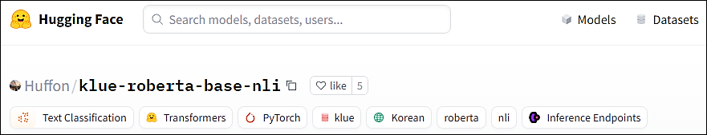

# Sentiment-Analysis

## 1. Project Intro

**Sentiment-Analysis** is a powerful tool designed to assess the sentiment of text data using advanced **NLP** techniques. This project leverages a Hugging Face model to analyze sentiment, allowing for a nuanced understanding of positive and negative sentiments in various contexts.



### Algorithm Modifications
Through the process of re-training the model and tuning hyperparameters, we have significantly improved the model's performance. The algorithm remains consistent with the existing sentiment classification model, ensuring reliability while enhancing accuracy.

### Accuracy Improvement
An evaluation was conducted on a dataset of 7,936 samples generated for training the sentiment classification model, resulting in an impressive accuracy increase from the original 82.8% to 91.5%. This improvement suggests that the model will perform substantially better in real-world applications.

<!-- ### Key Features
- **Feature 1: Multi-Language Translation Support**
  - The project supports translation between multiple languages using both Google Translate and Papago. Users can easily switch between these services depending on their needs.
  
- **Feature 2: Raw Data Preprocessing**
  - It includes a robust preprocessing system that cleans and formats raw text data before translation. This ensures that translations are more accurate and meaningful by eliminating unnecessary characters or symbols.

- **Feature 3: Results Management and Storage**
  - After the translation process, results are saved and managed efficiently. Users can save translated data in different formats and access previous translations easily.

## 2. Project Structure

The project is organized as follows:
```plaintext
.
├── codes/                         
│   ├── dataReader/                
│   │   └── rawDataReader.py       
│   ├── preprocessor/              
│   │   └── characterProcessor.py  # Script for processing character data
│   ├── resultManager/             
│   │   └── resultSaver.py         
│   ├── translator/                # Module for translation functionality
│   │   ├── googleTranslator.py    
│   │   └── papagoTranslator.py    
│   └── wrapper/                   
│       └── wrapperTranslator.py   # Unified interface to use both translation services (Google, Papago)
├── data/                          
│   ├── rawData/                   # Folder containing raw, unprocessed data
│   └── translatedData/            # Folder containing translated or processed data
├── main.py                        # Main script to run the project
├── README.md                      
└── requirements.txt               
```
## 3. How to Use the Project

### 3.1 Installation

Follow these steps to set up the project:

1. Clone the repository:
    ```bash
    git clone https://github.com/2zi-sung/text-translator.git
    ```

2. Navigate to the project directory:
    ```bash
    cd text-translator
    ```

3. Install the required dependencies:
    ```bash
    pip install -r requirements.txt
    ```

### 3.2 Usage

To run the project and translate text, follow these steps:

1. Prepare your raw data in the `data/rawData/` folder. The data should be in plain text format.

2. Run the main script to start the translation process:
    ```bash
    python main.py
    ```

3. You will be prompted to select a translation service (Google Translate or Papago) and specify the source and target languages.
    ```
    Source Language: en
    Target Language: ko
    ```

4. The project will preprocess the raw data, translate it using the selected service, and save the translated output to the `data/translatedData/` folder. -->